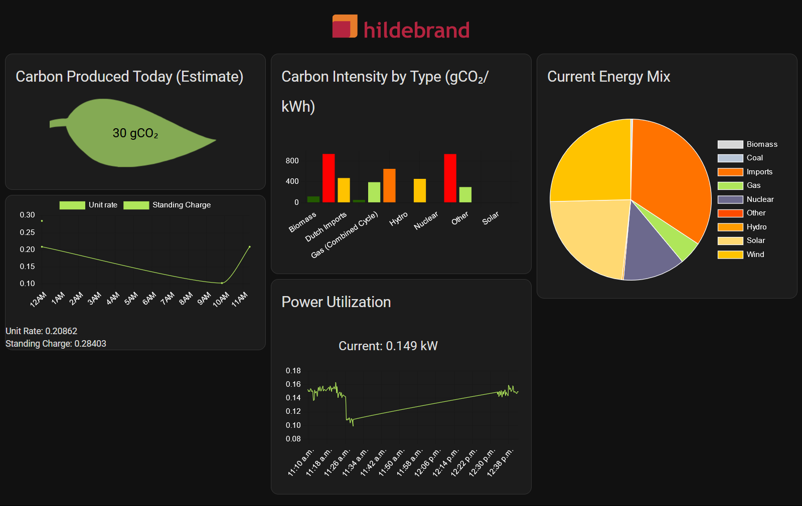

# Home Assistant Integration for Hildebrand Glow Hub
This integration exposes sensor entities that fetch data via MQTT from your smart meterm. Additionally, this integration fetches public data from the internet, providing further insights into your energy consumption. Bundled with this integration is a custom Glow dashboard for Home assistant, as well as access to the custom cards used for the dashboard for use in your own dashboards. See the images below.

# Installation
## Requirements
